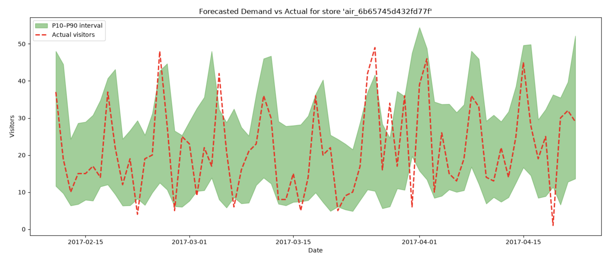

# Restaurant Demand Forecasting for EatClub 🍽️
**End-to-end MLOps on Databricks:** Demand forecasting with LightGBM gradient boosting, time-series cross-validation, calibrated P10/P90 quantile bands, MLflow experiment tracking, model versioning, and automated deployment via Databricks Asset Bundles.


## Overview

At its core, EatClub helps restaurants fill tables that would otherwise go empty. Venues offer discreet, dynamically priced discounts that work seamlessly with EatClubPay, and owners can tune them at a granular level to shape demand in real time. It even works in their favour psychologically, since a busy looking restaurant is the kind that draws in more customers. Powering all of this is machine learning across demand forecasting, affinity, and more.

This project is a working demonstration of that demand forecasting problem, built end to end on the same Databricks stack EatClub runs on. It predicts how many diners a restaurant will see on a given day, and attaches a confidence range to every prediction, so a venue sees something like "expect 30 to 60 covers" rather than a single number it cannot plan around.

*Dataset: Recruit Restaurant visitor data (Tokyo), ~252k restaurant-days.*


## Key Results

| Metric | Model | Baseline (last open day) | Improvement |
|:---|:---:|:---:|:---:|
| RMSE (visitors) | **13.1** | 17.5 | 25% lower |
| MAE (visitors) | **7.9** | 10.8 | 27% lower |


- **Validated, not overfit** — time-series cross-validation (0.566 log-RMSE) closely matches held-out test performance (0.548)
- **Calibrated 80% prediction intervals** — capture 79.1% of actual outcomes, giving trustworthy uncertainty bands




## Architecture

    Raw CSV
      │
      ▼
    Preprocessing  ──►  Delta tables (Unity Catalog)
      │                 dev.restaurant_forecasting.{train_set, test_set}
      ▼
    Model training
      ├─ Tuned LightGBM (time-series CV)  ──►  MLflow registry (versioned)
      └─ Quantile models (P10/P50/P90)    ──►  calibrated intervals
      │
      ▼
    Serving endpoint (Databricks Model Serving)

The whole pipeline is packaged as a **Databricks Asset Bundle** and runs as a scheduled workflow on serverless compute: `preprocess → train → register → deploy`.


## Technical Highlights

- **Time-series cross-validation** for hyperparameter tuning — tuned on the training window, evaluated on a held-out future period, so reported performance reflects true forward-looking accuracy rather than leakage
- **Quantile regression (P10 / P50 / P90)** for calibrated prediction intervals — validated by empirical coverage, giving per-day confidence bands rather than bare point estimates
- **LightGBM gradient boosting** for tabular demand forecasting, with native categorical handling
- **Feature engineering for time series** — a "last open day" lag that is robust to venue closures (skips gaps in the series rather than returning nulls), a date-based 7-day rolling average, plus calendar features (day-of-week, month, holiday, weekend)
- **Log-transformed target** to handle the heavy right-skew typical of count/demand data
- **MLflow experiment tracking and Unity Catalog model registry** — every model versioned, tagged with its git commit for full traceability
- **Automated deployment pipeline** via Databricks Asset Bundles — preprocess, train, register, and serve orchestrated as a scheduled workflow (infrastructure-as-code)
- **Typed, validated configuration** (Pydantic) and a modular `src/` package — importable, testable, and reused across pipelines, scripts, and serving


## Project Structure

    ├── src/restaurant_forecasting/   # Core logic (importable package)
    │   ├── config.py                 # Pydantic-validated config loader
    │   ├── data_processor.py         # Preprocessing + feature engineering
    │   ├── basic_model.py            # Tuned point model
    │   ├── quantile_model.py         # Prediction-interval models
    │   └── model_serving.py          # Serving endpoint management
    ├── pipelines/                    # Interactive dev drivers
    ├── scripts/                      # Automated entry points (bundle jobs)
    ├── notebooks/                    # EDA + visualization
    ├── resources/                    # Bundle workflow definition
    ├── project_config.yml            # Project settings (features, catalogs, params)
    ├── databricks.yml                # Asset Bundle config
    └── pyproject.toml                # Dependencies + build config


## How to Run

```bash
# Set up the environment
uv sync --extra dev

# Run the pipeline locally (via Databricks Connect)
python pipelines/data_preprocessing.py   # preprocess -> Delta tables
python pipelines/train_basic.py           # tune, evaluate, register

# Or deploy the full automated workflow to Databricks
databricks bundle deploy
databricks bundle run restaurant_forecasting_workflow
```


## Mistakes, Fixes & Lessons


- **Training-serving skew with categorical features.** The model trained on pandas `category`-dtype columns, but the serving endpoint receives plain strings, causing a mismatch at inference. The endpoint deploys and the pipeline runs, but inference needs the categories encoded consistently across training and serving. The standard fixes are: integer-encoding the categories with a saved mapping applied at both ends, bundling the encoding inside the model artifact (a pyfunc wrapper), or — at scale — a **feature store** that guarantees online/offline feature consistency. Resolving this is the clearest next step.

- **Row-based vs date-based features.** An early "yesterday" lag used a naive row shift, which silently broke when restaurants closed for a day (7 rows ago ≠ 7 days ago). Switching to a "last open day" lag and a date-windowed rolling average fixed it — a reminder that time-series features need to respect the calendar, not just row order.

- **Getting the scale right.** The target is log-transformed, so predictions, baselines, and metrics all have to be converted back consistently. Mixing log and real scale is an easy, silent source of wrong numbers; being deliberate about when to apply `expm1` mattered.


